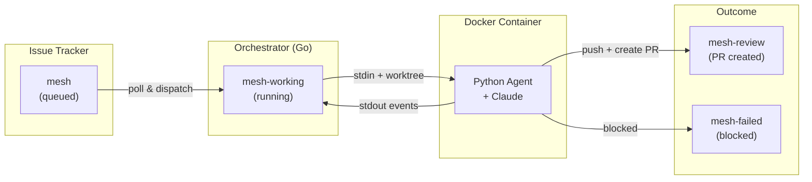
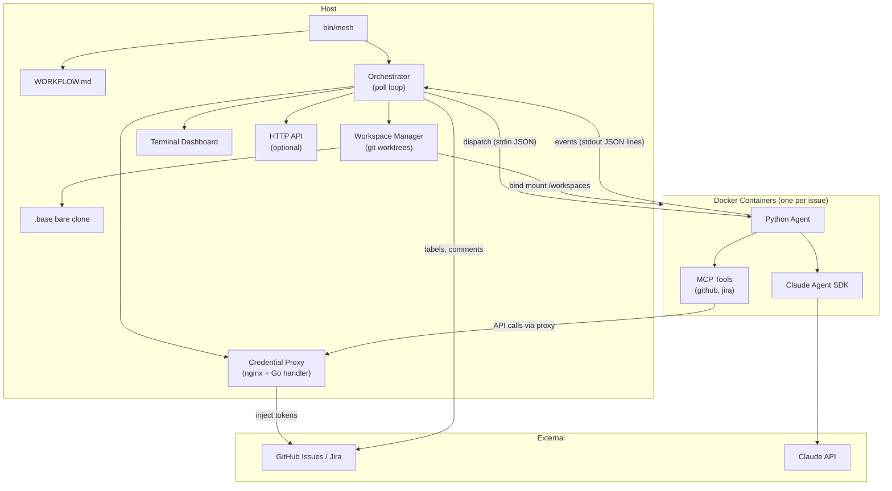

<table align="center"><tr><td>
<pre>
███╗   ███╗███████╗███████╗██╗  ██╗
████╗ ████║██╔════╝██╔════╝██║  ██║
██╔████╔██║█████╗  ███████╗███████║
██║╚██╔╝██║██╔══╝  ╚════██║██╔══██║
██║ ╚═╝ ██║███████╗███████║██║  ██║
╚═╝     ╚═╝╚══════╝╚══════╝╚═╝  ╚═╝
</pre>
</td></tr></table>

<p align="center">
<b>Autonomous Coding Agent Orchestrator</b><br>
Watches your issue tracker, dispatches AI agents to write code, and delivers pull requests
</p>

<p align="center">
<a href="https://go.dev/"></a>
<a href="LICENSE"></a>
</p>

## How It Works

Mesh connects to your issue tracker (GitHub Issues or Jira), picks up issues labeled `mesh`, and dispatches Docker containers running an AI coding agent to implement them. Each agent gets its own git worktree, writes code, runs tests, creates a pull request, and signals completion — all autonomously.



**Lifecycle labels** are the source of truth:

| Label | Meaning |
|-------|---------|
| `mesh` | Queued for pickup |
| `mesh-working` | Agent is actively working |
| `mesh-review` | PR created, ready for human review |
| `mesh-failed` | Agent gave up (blocked, max retries) |

## Architecture



### Project Structure

```
mesh/
├── cmd/mesh/              # CLI entry point
├── internal/
│   ├── config/            # WORKFLOW.md parser, env resolution, hot-reload
│   ├── model/             # Shared types (Issue, RunningEntry, AgentEvent)
│   ├── orchestrator/      # Poll loop, dispatch, reconciliation, retries
│   ├── runner/            # Docker container lifecycle, event streaming
│   ├── workspace/         # Git worktree management (create, reset, remove)
│   ├── tracker/           # GitHub and Jira API clients
│   ├── proxy/             # Credential proxy (nginx) + GitHub API handler
│   ├── tui/               # Terminal dashboard (Bubble Tea)
│   ├── server/            # Optional HTTP API
│   ├── template/          # Prompt template rendering
│   ├── prompts/           # Agent system prompt
│   ├── logging/           # Structured logging
│   └── sentry/            # Error reporting
├── agent/                 # Python agent (runs in Docker)
│   ├── src/mesh_agent/
│   │   ├── main.py        # Entry point, stdin parsing
│   │   ├── session.py     # Claude SDK client session
│   │   ├── sdk_config.py  # Tool and model configuration
│   │   ├── events.py      # JSON-line event emitter
│   │   └── tools/         # MCP tools (GitHub, Jira)
│   ├── Dockerfile
│   └── pyproject.toml
└── tests/integration/     # End-to-end tests
```

### Orchestrator

The orchestrator runs a single-goroutine poll loop — no mutexes needed. Each tick:

1. **Reconcile** — Detect stalls, turn timeouts, terminal states, orphans, external label changes
2. **Process retries** — Execute retries with exponential backoff + jitter
3. **Fetch candidates** — Query tracker for `mesh`-labeled issues
4. **Filter and sort** — Check eligibility (not already running, not blocked, slot available)
5. **Dispatch** — Create worktree, start Docker container, label `mesh-working`

### Agent

The Python agent runs inside a Docker container. It receives context via stdin (JSON) and streams events back via stdout (JSON lines). It uses the Claude Agent SDK with MCP tools for all tracker and git operations.

### Workspace Isolation

Each issue gets a git worktree branched from `origin/main`. The orchestrator maintains a shared bare clone at `~/.mesh/workspaces/.base` and creates lightweight worktrees for each agent. Worktree `.git` files are rewritten to use relative paths so they work inside Docker containers where the mount point differs from the host.

### Credential Proxy

The agent container has no credentials. All authenticated operations (GitHub API calls, git push) go through a host-side proxy:

- **GitHub API proxy** — Go HTTP handler at `host.docker.internal:9481` that injects GitHub App tokens
- **Credential proxy** — nginx at `host.docker.internal:9480` for Jira token injection

## Quick Start

### 1. Prerequisites

- Go 1.25+
- Docker
- A [GitHub App](https://docs.github.com/en/apps/creating-github-apps) with Issues + Pull Requests permissions
- A Claude API key

### 2. Install

```bash
git clone https://github.com/kilupskalvis/mesh.git
cd mesh
make build          # builds bin/mesh
make docker-agent   # builds mesh-agent:latest Docker image
```

### 3. Configure

Create a `WORKFLOW.md` in your working directory:

```markdown
---
tracker:
  kind: github
  owner: your-org
  repo: your-repo
  label: mesh
  app_id: $GITHUB_APP_ID
  installation_id: $GITHUB_INSTALLATION_ID
  private_key_path: ~/.config/mesh/github-app.pem

workspace:
  repo_url: https://github.com/your-org/your-repo.git
---
You are working on issue {{ .Issue.Identifier }}.

{{ .Issue.Description }}
```

Set environment variables (or use a `.env` file):

```bash
export GITHUB_APP_ID=123456
export GITHUB_INSTALLATION_ID=789012
export CLAUDE_API_KEY=sk-ant-...
```

### 4. Run

```bash
./bin/mesh
```

Mesh starts polling your tracker, shows a terminal dashboard, and dispatches agents as issues are labeled `mesh`.

### 5. Use

Label a GitHub issue with `mesh`. The orchestrator picks it up, spins up a Docker container, and the agent:

1. Reads the issue
2. Explores the codebase
3. Implements the fix/feature
4. Runs tests
5. Creates a pull request
6. Sets the label to `mesh-review`

## Configuration

Mesh is configured through a single `WORKFLOW.md` file — YAML front matter for settings, markdown body for the prompt template sent to the agent.

### Tracker

<details>
<summary><b>GitHub Issues</b></summary>

```yaml
tracker:
  kind: github
  owner: your-org          # repository owner
  repo: your-repo          # repository name
  label: mesh              # label to watch (default: mesh)
  app_id: $GITHUB_APP_ID
  installation_id: $GITHUB_INSTALLATION_ID
  private_key_path: ~/.config/mesh/github-app.pem
  active_states:           # optional (default: [open])
    - open
  terminal_states:         # optional (default: [closed])
    - closed
```

Requires a GitHub App with read/write permissions for Issues, Pull Requests, and Contents.

</details>

<details>
<summary><b>Jira</b></summary>

```yaml
tracker:
  kind: jira
  endpoint: https://your-org.atlassian.net
  email: $JIRA_EMAIL
  api_token: $JIRA_API_TOKEN
  project_key: PROJ
  active_states:           # optional (default: [to do, in progress])
    - to do
    - in progress
  terminal_states:         # optional (default: [done, cancelled, closed, duplicate])
    - done
    - cancelled
```

</details>

### Polling

```yaml
polling:
  interval_ms: 30000       # how often to check for new issues (default: 30s)
```

### Workspace

```yaml
workspace:
  root: ~/.mesh/workspaces  # where git worktrees are created (default)
  repo_url: https://github.com/your-org/your-repo.git
```

Each issue gets its own git worktree branched from `origin/main`. Worktrees are bind-mounted into Docker containers at `/workspaces`.

### Agent

```yaml
agent:
  image: mesh-agent:latest           # Docker image (default)
  model: claude-sonnet-4-6           # Claude model (default)
  api_key: $CLAUDE_API_KEY           # defaults to $CLAUDE_API_KEY
  max_concurrent_agents: 10          # global concurrency limit (default)
  max_turns: 20                      # max Claude turns per session (default)
  max_error_retries: 3               # retries on crash/error (default)
  max_continuations: 5               # continuation sessions on clean exit (default)
  turn_timeout_ms: 3600000           # max wall-clock per session (default: 1h)
  stall_timeout_ms: 300000           # kill if no events for 5min (default)
  retry_backoff_base_ms: 10000       # base delay for retry backoff (default: 10s)
  max_retry_backoff_ms: 300000       # max retry delay (default: 5min)
  max_concurrent_agents_by_state:    # per-state concurrency limits (optional)
    in progress: 5
    to do: 2
  docker_options:                    # optional container resource limits
    memory: 2g
    cpus: 2
    network: none
    extra_env:
      MY_CUSTOM_VAR: value
```

### Hooks

Run shell commands at key points in the workspace lifecycle:

```yaml
hooks:
  after_create: echo "Worktree created at $WORKSPACE_PATH"
  before_run: npm install
  after_run: make clean
  before_remove: echo "Cleaning up"
  timeout_ms: 60000                  # hook execution timeout (default: 60s)
```

### Server

Optional HTTP API for external integrations:

```yaml
server:
  port: 8080    # -1 to disable (default)
```

| Endpoint | Method | Description |
|----------|--------|-------------|
| `/api/v1/state` | GET | Current orchestrator state (running, retries, completed) |
| `/api/v1/refresh` | POST | Trigger an immediate poll cycle |

### Observability

```yaml
observability:
  sentry_dsn: https://...@sentry.io/...
```

### Proxy

```yaml
proxy:
  listen_port: 9480    # credential proxy port (default)
```

The agent container never sees credentials directly. All authenticated API calls are proxied through the host, which injects tokens at request time.

### Prompt Template

The markdown body of `WORKFLOW.md` (below the `---` front matter) is the prompt template sent to each agent. It uses Go `text/template` syntax:

```markdown
---
# ... config above ...
---
You are working on issue {{ .Issue.Identifier }}: {{ .Issue.Title }}

{{ .Issue.Description }}

Focus on writing clean, tested code that follows the project's conventions.
```

Available template variables:

| Variable | Type | Description |
|----------|------|-------------|
| `.Issue.Identifier` | string | Issue reference (e.g., `#42`, `PROJ-42`) |
| `.Issue.Title` | string | Issue title |
| `.Issue.Description` | *string | Issue body/description |
| `.Issue.State` | string | Current state |
| `.Issue.Labels` | []string | Current labels |
| `.Issue.URL` | *string | Link to issue |
| `.Issue.BranchName` | *string | Suggested branch name |

## Retry and Recovery

| Scenario | Behavior |
|----------|----------|
| Agent crashes (non-zero exit) | Error retry with exponential backoff |
| Agent exits cleanly but still `mesh-working` | Continuation (1s delay, fresh session) |
| No events for `stall_timeout_ms` | Kill container, error retry |
| Wall-clock exceeds `turn_timeout_ms` | Kill container, error retry |
| Max error retries exceeded | Label `mesh-failed`, post comment |
| Max continuations exceeded | Label `mesh-failed`, post comment |
| Issue closed externally while running | Stop container, record cancellation |
| Labels changed externally | Stop container, respect new label |
| Crash recovery (orchestrator restart) | Roll orphaned `mesh-working` back to `mesh` |

## Development

```bash
make setup             # install git hooks, staticcheck, uv deps
make build             # build bin/mesh
make docker-agent      # build agent Docker image
make test              # run Go + Python tests
make test-integration  # run E2E integration tests
make lint              # run all linters
make check             # run pre-commit hooks
```

### Running Locally

```bash
# Terminal 1: build and run
make build && make docker-agent
./bin/mesh WORKFLOW.md

# Terminal 2: label an issue
gh issue edit 42 --add-label mesh
```

## Requirements

- Go 1.25+
- Python 3.13+ (agent)
- Docker
- Claude API key

## License

MIT
